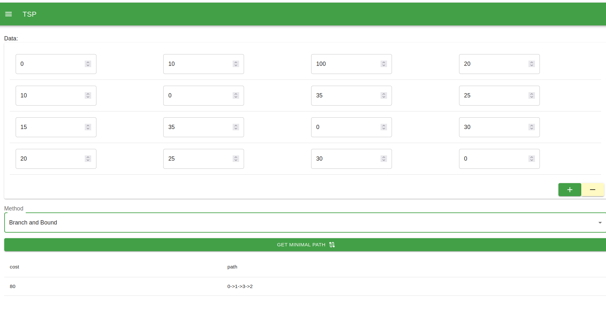

# Programa para calcular el camino más corto y el problema del coste mínimo del viajero (TSP) mediante programación dinámica y branch and pruning. (Español)

## Introducción

El TSP (Traveling Salesman Problem) o Problema del Viajante de Comercio es un problema de optimización combinatoria en el campo de la teoría de grafos. En esencia, el TSP busca encontrar la ruta más corta que un viaje de comercio puede tomar para visitar un conjunto de ciudades dado, pasando exactamente una vez por cada ciudad y regresando al punto de partida.

El objetivo del TSP es minimizar la distancia total recorrida o el costo asociado a visitar todas las ciudades sin repetir ninguna. Es un problema NP-duro, lo que significa que no se conocen algoritmos eficientes que encuentren la solución óptima en tiempo polinomial para todas las instancias posibles.

Dado un conjunto de ciudades y las distancias entre ellas, el TSP implica encontrar la permutación óptima de las ciudades para minimizar la distancia total recorrida. Esto se puede representar como un grafo completo, donde las ciudades son los vértices y las distancias entre ellas son los pesos de las aristas. El objetivo es encontrar el ciclo hamiltoniano de longitud minima en este grafo.

## La programación dinámica

La programación dinámica es una técnica utilizada para resolver problemas de optimización dividiéndolos en subproblemas superpuestos y resolviendo cada subproblema solo una vez. Es particularmente útil para problemas que exhiben la propiedad de superposición de subproblemas y subestructura óptima.

Aquí hay un marco general para resolver problemas usando programación dinámica:

1. Definir el problema: Definir claramente el problema e identificar el objetivo o criterio de optimización.

2. Identifique la propiedad recursiva: determine cómo se puede expresar la solución óptima del problema original en términos de soluciones óptimas para subproblemas más pequeños. Esto se hace a menudo a través de fórmulas o relaciones recursivas.

3. Formule los casos base: determine los casos base o los subproblemas más pequeños que se pueden resolver directamente sin más recurrencia. Los casos base proporcionan los valores iniciales para los cálculos recursivos.

4. Definir la tabla de memorización: Determinar la estructura de datos para almacenar los resultados intermedios de los subproblemas. Suele ser una matriz, matriz o tabla hash, según la naturaleza del problema.

5. Defina la relación de recurrencia: defina la relación entre el subproblema actual y sus subproblemas más pequeños. Esto le permite calcular la solución óptima para el subproblema actual en función de las soluciones de sus subproblemas más pequeños.

6. Implemente el algoritmo de programación dinámica: use la iteración o la recursividad (con memoización) para completar la tabla de memoización, comenzando desde los casos base y progresando hacia la solución final.

7. Extraiga la solución: una vez que se llene la tabla de memorización, extraiga la solución final de la tabla según los requisitos del problema. Esto podría implicar retroceder o cálculos adicionales basados en los valores memorizados.

La programación dinámica se puede aplicar a varios problemas, como el problema de la mochila, la secuencia de Fibonacci, los problemas de la ruta más corta y muchos más. La idea clave es evitar cálculos redundantes almacenando los resultados de los subproblemas y reutilizándolos cuando sea necesario, lo que lleva a algoritmos más eficientes.

## Ejecución

## Branch and Bound 

Branch and Bound es una técnica algorítmica general utilizada para resolver problemas de optimización, particularmente en optimización combinatoria. Explora sistemáticamente el espacio de búsqueda de posibles soluciones ramificándose en subproblemas y acotando la búsqueda en función de ciertos criterios.

La idea principal detrás del algoritmo Branch and Bound es dividir el problema en subproblemas más pequeños, llamados ramas, y realizar un seguimiento de los límites (límites inferiores o superiores) para cada rama. Esto permite que el algoritmo elimine ciertas ramas que seguramente conducirán a soluciones subóptimas, reduciendo el espacio de búsqueda y mejorando la eficiencia.

Aquí hay un resumen general de cómo funciona el algoritmo Branch and Bound:

1. Formular el problema de optimización: Definir claramente el problema y su objetivo. Determinar los criterios de optimalidad.

2. Crea un límite inicial: Calcula un límite inicial para el problema. Esto se puede hacer usando heurística, límites inferiores u otras técnicas dependiendo del problema.

3. Cree el nodo inicial: Cree un nodo inicial que represente el punto de partida del problema.

4. Ramificación: elija una variable o un punto de decisión en el problema y cree nodos secundarios ramificándose desde el nodo actual. Cada nodo secundario representa una posible elección u opción.

5. Cálculo de límites: calcule un límite para cada nodo secundario. Puede ser un límite superior o un límite inferior según el objetivo del problema. Los límites ayudan a determinar si una rama se puede podar o explorar más.

6. Poda: si el límite de un nodo secundario excede la mejor solución actual o viola ciertas restricciones, elimine esa rama y su subárbol, ya que no puede conducir a una solución óptima.

7. Actualice la mejor solución: cada vez que se alcance un nodo hoja (una solución completa), compare su valor objetivo con la mejor solución actual. Si mejora la mejor solución actual, actualícela en consecuencia.

8. Retroceda y explore otras ramas: retroceda hasta el nodo principal y explore otros nodos secundarios, repitiendo los pasos 4 a 7 hasta que todos los nodos estén explorados o eliminados.

9. Repita los pasos 4 a 8 hasta explorar por completo el espacio de búsqueda.

La eficacia del algoritmo Branch and Bound se basa en la calidad de los límites utilizados y la estrategia de ramificación. Las elecciones inteligentes para la selección de variables, los cálculos de límites y las condiciones de poda pueden mejorar en gran medida la eficiencia del algoritmo.

## Ejecución

## Acerca del autor 
Estuandite de Doctorado: Juan Carlos Moreno Sanchez

<carlos.moreno.phd@gmail.com>

<jcmorenos001@alumno.uaemex.mx>

# Program to calculate the shortest path and the minimum cost of traveler problem (TSP) using dynamic programming and branch and bound. (English)

## Introduction

The TSP (Traveling Salesman Problem) is a combinatorial optimization problem in the field of graph theory. In essence, the TSP seeks to find the shortest route that a trade trip can take to visit a given set of cities, passing through each city exactly once and returning to the starting point.

The objective of the TSP is to minimize the total distance traveled or the cost associated with visiting all the cities without repeating any. It is an NP-hard problem, which means that there are no known efficient algorithms that find the optimal solution in polynomial time for all possible instances.

Given a set of cities and the distances between them, the TSP involves finding the optimal permutation of cities to minimize the total distance traveled. This can be represented as a complete graph, where the cities are the vertices and the distances between them are the weights of the edges. The objective is to find the Hamiltonian cycle of minimum length in this graph.

## Dynamic programming

Dynamic programming is a technique used to solve optimization problems by breaking them down into overlapping subproblems and solving each subproblem only once. It is particularly useful for problems that exhibit the property of overlapping subproblems and optimal substructure.

Here is a general framework for solving problems using dynamic programming:

1. Define the problem: Clearly define the problem and identify the objective or criteria for optimality.

2. Identify the recursive property: Determine how the optimal solution to the original problem can be expressed in terms of optimal solutions to smaller subproblems. This is often done through recursive relations or formulas.

3. Formulate the base cases: Determine the base cases or smallest subproblems that can be solved directly without further recursion. Base cases provide the initial values for the recursive calculations.

4. Define the memoization table: Determine the data structure to store the intermediate results of the subproblems. This is often an array, matrix, or hash table, depending on the nature of the problem.

5. Define the recurrence relation: Define the relationship between the current subproblem and its smaller subproblems. This allows you to calculate the optimal solution for the current subproblem based on the solutions to its smaller subproblems.

6. Implement the dynamic programming algorithm: Use iteration or recursion (with memoization) to fill in the memoization table, starting from the base cases and progressing towards the final solution.

7. Extract the solution: Once the memoization table is filled, extract the final solution from the table based on the problem requirements. This could involve backtracking or additional calculations based on the memoized values.

Dynamic programming can be applied to various problems, such as the Knapsack problem, Fibonacci sequence, shortest path problems, and many more. The key idea is to avoid redundant calculations by storing the results of subproblems and reusing them when needed, leading to more efficient algorithms.

## Execution

## Branch and Bound 

Branch and Bound is a general algorithmic technique used for solving optimization problems, particularly in combinatorial optimization. It systematically explores the search space of possible solutions by branching into subproblems and bounding the search based on certain criteria.

The main idea behind the Branch and Bound algorithm is to divide the problem into smaller subproblems, called branches, and keep track of bounds (lower or upper bounds) for each branch. This allows the algorithm to prune certain branches that are guaranteed to lead to suboptimal solutions, reducing the search space and improving efficiency.

Here's a general outline of how the Branch and Bound algorithm works:

1. Formulate the optimization problem: Clearly define the problem and its objective. Determine the criteria for optimality.

2. Create an initial bound: Calculate an initial bound for the problem. This can be done using heuristics, lower bounds, or other techniques depending on the problem.

3. Create the initial node: Create an initial node representing the starting point of the problem.

4. Branching: Choose a variable or decision point in the problem and create child nodes by branching out from the current node. Each child node represents a possible choice or option.

5. Bound calculation: Calculate a bound for each child node. This can be an upper bound or lower bound based on the problem's objective. The bounds help determine if a branch can be pruned or explored further.

6. Pruning: If the bound of a child node exceeds the current best solution or violates certain constraints, prune that branch and its subtree, as it cannot lead to an optimal solution.

7. Update the best solution: Whenever a leaf node (a complete solution) is reached, compare its objective value to the current best solution. If it improves the current best solution, update it accordingly.

8. Backtrack and explore other branches: Backtrack to the parent node and explore other child nodes, repeating steps 4 to 7 until all nodes are explored or pruned.

9. Repeat steps 4 to 8 until the search space is completely explored.

The effectiveness of the Branch and Bound algorithm relies on the quality of the bounds used and the branching strategy. Intelligent choices for variable selection, bound calculations, and pruning conditions can greatly improve the algorithm's efficiency.

## Ejecución

## About the author
Student of PhD: Juan Carlos Moreno Sanchez

<carlos.moreno.phd@gmail.com>

<jcmorenos001@alumno.uaemex.mx>