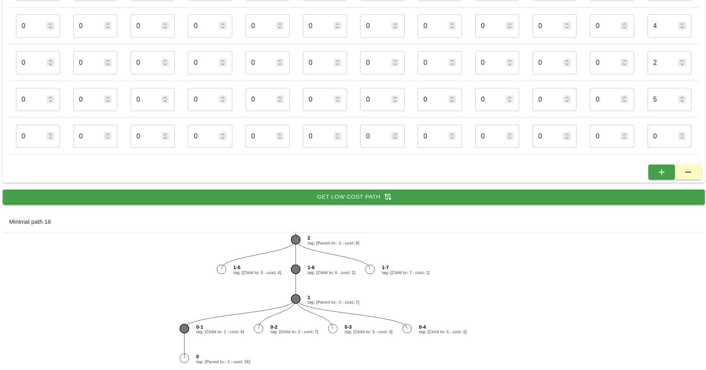

# Programa para encontrar el camino más corto en un gráfico utilizando el algoritmo de gráfico multietapa, muestra su árbol de ejecución. (Español)

## Introducción

La teoría de grafos es una rama de las matemáticas que estudia las propiedades y relaciones de los grafos. Un grafo es una estructura que consta de un conjunto de vértices o nodos, y un conjunto de aristas que conectan los vértices. Los grafos se utilizan para representar y analizar relaciones entre objetos, como redes de comunicación, relaciones sociales, rutas de transporte, circuitos eléctricos, entre otros.

A continuación, se presentan algunos conceptos fundamentales en la teoría de grafos:

Vértices y aristas: Los vértices son los nodos del grafo, y las aristas son las conexiones entre los vértices. Las aristas pueden ser dirigidas (tienen una dirección) o no dirigidas (no tienen una dirección específica).

Grafos dirigidos y no dirigidos: En un grafo dirigido, las aristas tienen una dirección específica, lo que significa que se puede viajar en una dirección determinada a lo largo de la arista. En un grafo no dirigido, las aristas no tienen una dirección específica y se pueden recorrer en ambas direcciones.

Caminos y ciclos: Un camino es una secuencia de aristas que conecta un conjunto de vértices sin repetir vértices. Un ciclo es un camino cerrado en el que el vértice final es el mismo que el vértice inicial.

Grados de los vértices: El grado de un vértice en un grafo no dirigido es el número de aristas incidentes en ese vértice. En un grafo dirigido, el grado de entrada de un vértice es el número de aristas entrantes en ese vértice, mientras que el grado de salida es el número de aristas salientes desde ese vértice.

Grafos ponderados: En algunos grafos, las aristas tienen un peso o costo asociado que representa alguna medida de distancia, tiempo, costo, etc. Estos grafos se denominan grafos ponderados.

## El algoritmo de gráfico multietapa

El algoritmo de gráfico multietapa, también conocido como algoritmo de ruta más corta de gráfico multietapa, se utiliza para encontrar la ruta más corta en un gráfico con múltiples etapas o niveles. Cada etapa representa un conjunto de vértices, y el objetivo es encontrar el camino más corto que comienza desde un vértice de origen en la primera etapa y termina en un vértice de destino en la última etapa, visitando exactamente un vértice de cada etapa.

Aquí hay una descripción general de alto nivel del algoritmo gráfico de varias etapas:

Defina el gráfico de etapas múltiples: represente el gráfico como un conjunto de etapas, donde cada etapa contiene vértices y bordes dirigidos entre etapas. Los bordes pueden ser ponderados o no ponderados, lo que representa el costo o la distancia entre los vértices.

Inicialice las estructuras de datos: cree una matriz o matriz para almacenar los costos mínimos de llegar a cada vértice desde el vértice de origen. Inicialice los costos mínimos para todos los vértices hasta el infinito, excepto el vértice de origen, que se establece en 0.

Atraviese el gráfico: Comience desde la primera etapa y recorra las etapas posteriores. Para cada vértice en la etapa actual, encuentre la ruta de costo mínimo para llegar a ese vértice de la etapa anterior. Actualice el costo mínimo si se encuentra una ruta más corta.

Seguimiento de la ruta: junto con la actualización de los costos mínimos, realice un seguimiento del vértice predecesor o principal que conduce a la ruta de costo mínimo para cada vértice. Esta información se utilizará para reconstruir la ruta más corta al final.

Encuentre la ruta más corta: después de atravesar todas las etapas, el costo mínimo para llegar a cada vértice en la última etapa representa la ruta más corta desde el vértice de origen hasta ese vértice. Reconstruya la ruta más corta retrocediendo desde el vértice de destino utilizando la información del predecesor obtenida durante el recorrido.

El algoritmo gráfico multietapa se puede implementar utilizando varios enfoques, como la programación dinámica o la clasificación topológica, según las características específicas del problema.

Tenga en cuenta que la eficiencia y la complejidad del algoritmo dependen del tamaño del gráfico y la cantidad de etapas. Es importante tener en cuenta estos factores y elegir estructuras de datos y algoritmos apropiados para optimizar la solución.

## Ejecución

## Acerca del autor 
Estuandite de Doctorado: Juan Carlos Moreno Sanchez

<carlos.moreno.phd@gmail.com>

<jcmorenos001@alumno.uaemex.mx>

# Program to find the shortest path in a graph using the multi-stage graph algorithm, shows its execution tree. (English)

## Introduction

Graph theory is a branch of mathematics that studies the properties and relationships of graphs. A graph is a structure consisting of a set of vertices or nodes, and a set of edges connecting the vertices. Graphics are used to represent and analyze relationships between objects, such as communication networks, social relationships, transportation routes, electrical circuits, among others.

Here are some fundamental concepts in graph theory:

Vertices and edges: The vertices are the nodes of the graph, and the edges are the connections between the vertices. Edges can be directed (have a direction) or undirected (do not have a specific direction).

Directed and Undirected Graphs: In a directed graph, the edges have a specific direction, which means that you can travel in a certain direction along the edge. In an undirected graph, the edges do not have a specific direction and can be traversed in both directions.

Paths and Cycles: A path is a sequence of edges that connects a set of vertices without repeating vertices. A cycle is a closed path in which the final vertex is the same as the initial vertex.

Vertex degrees: The degree of a vertex in an undirected graph is the number of edges incident on that vertex. In a directed graph, the indegree of a vertex is the number of incoming edges at that vertex, while the outdegree is the number of outgoing edges from that vertex.

Weighted graphs: In some graphs, the edges have an associated weight or cost that represents some measure of distance, time, cost, etc. These graphs are called weighted graphs.

## The multistage graph algorithm

The multistage graph algorithm, also known as the multistage graph shortest path algorithm, is used to find the shortest path in a graph with multiple stages or levels. Each stage represents a set of vertices, and the goal is to find the shortest path that starts from a source vertex in the first stage and ends at a destination vertex in the last stage, while visiting exactly one vertex from each stage.

Here's a high-level overview of the multistage graph algorithm:

Define the multistage graph: Represent the graph as a set of stages, where each stage contains vertices and directed edges between stages. The edges can be weighted or unweighted, representing the cost or distance between vertices.

Initialize the data structures: Create an array or matrix to store the minimum costs of reaching each vertex from the source vertex. Initialize the minimum costs for all vertices to infinity, except for the source vertex, which is set to 0.

Traverse the graph: Start from the first stage and traverse through the subsequent stages. For each vertex in the current stage, find the minimum cost path to reach that vertex from the previous stage. Update the minimum cost if a shorter path is found.

Track the path: Along with updating the minimum costs, keep track of the predecessor or parent vertex that leads to the minimum cost path for each vertex. This information will be used to reconstruct the shortest path at the end.

Find the shortest path: After traversing all stages, the minimum cost to reach each vertex in the last stage represents the shortest path from the source vertex to that vertex. Reconstruct the shortest path by backtracking from the destination vertex using the predecessor information obtained during the traversal.

The multistage graph algorithm can be implemented using various approaches, such as dynamic programming or topological sorting, depending on the specific characteristics of the problem.

Keep in mind that the efficiency and complexity of the algorithm depend on the size of the graph and the number of stages. It's important to consider these factors and choose appropriate data structures and algorithms to optimize the solution.

## Execution

## About the author
Student of PhD: Juan Carlos Moreno Sanchez

<carlos.moreno.phd@gmail.com>

<jcmorenos001@alumno.uaemex.mx>